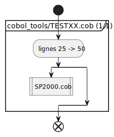

# Cobol tools
Series cobol related tools.

## Cobol activity diagram
### Description
Generates the [activity diagram](https://plantuml.com/activity-diagram-beta) from a cobol source code file.
The generated files are:
- puml text files that can be copy-pasted in a PlantUML confluence macro or the [PlantUML sandbox](https://www.plantuml.com/plantuml/uml/)
- SVG files

According to the cobol file size, there could be many generated files ; however, there will be at least 2 files:
- [activity_diagram_0.svg](activity_diagram_0.svg) will provide the overview of the many files and external dependencies (CALLs)


- the following activity_diagram_X.svg files will hold the source code in activity diagram form


Those diagram were created from [TESTXX.cob](TESTXX.cob)
### Howto
To run this ...

cobol_activity_diagram.py requires 2 params:
- the ROOT_FOLDER
- the cobol file path from the ROOT_FOLDER
This path split enables the discovery of the cobol module name

````
python cobol_activity_diagram.py "c:\dev" "cobol_tools\TESTXX.cob" 
````

## Debug mode