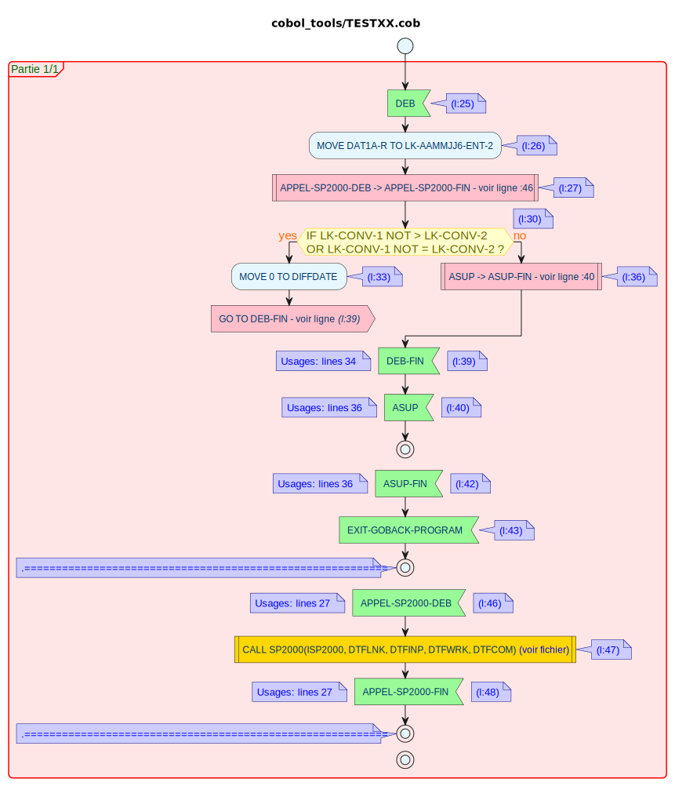

# Cobol tools

## Cobol activity diagram
Generates the [activity diagram](https://plantuml.com/activity-diagram-beta) from a cobol source code file.
The generated files are:
- puml text files that can be copy-pasted in a PlantUML confluence macro or the [PlantUML sandbox](https://www.plantuml.com/plantuml/uml/)
- SVG files

According to the cobol file size, there could be many generated files ; however, there will be at least 2 files:
- [activity_diagram_0.svg](activity_diagram_0.svg) will provide the overview of the many files and external dependencies (CALLs)

- the following activity_diagram_X.svg files will hold the source code in activity diagram form

## Debug mode